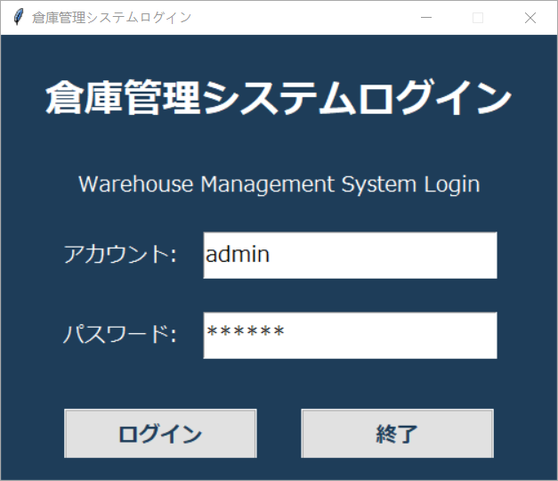
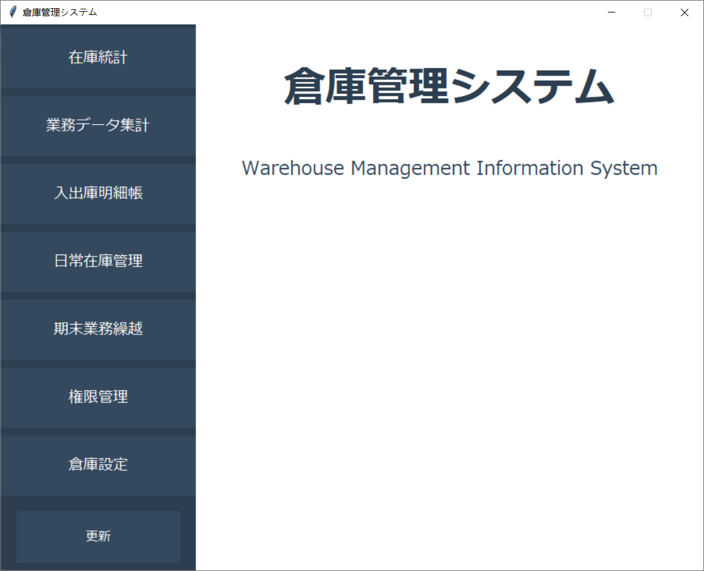
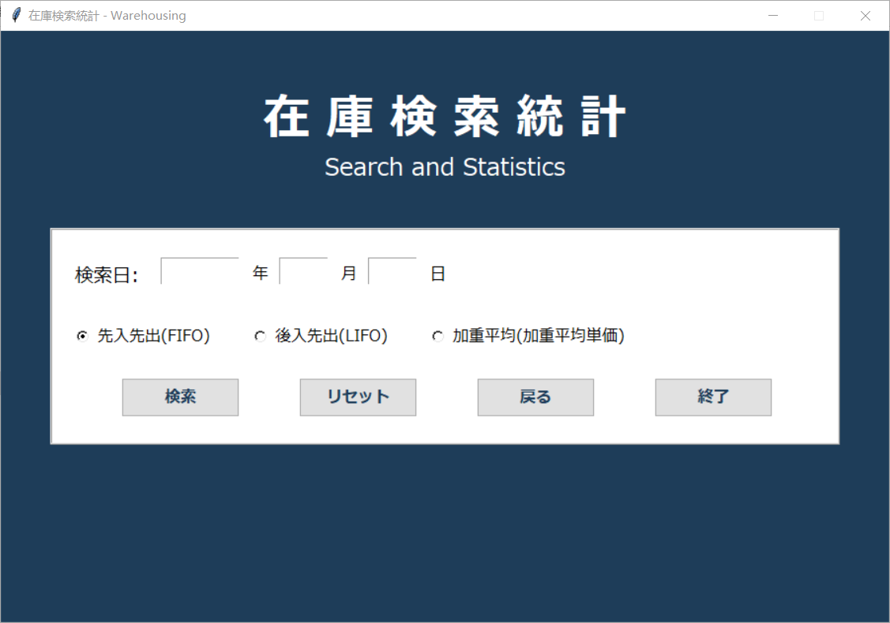
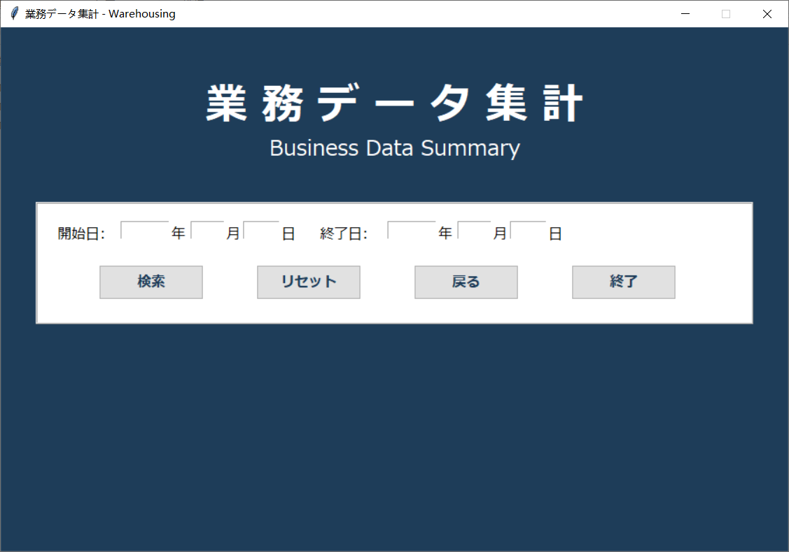
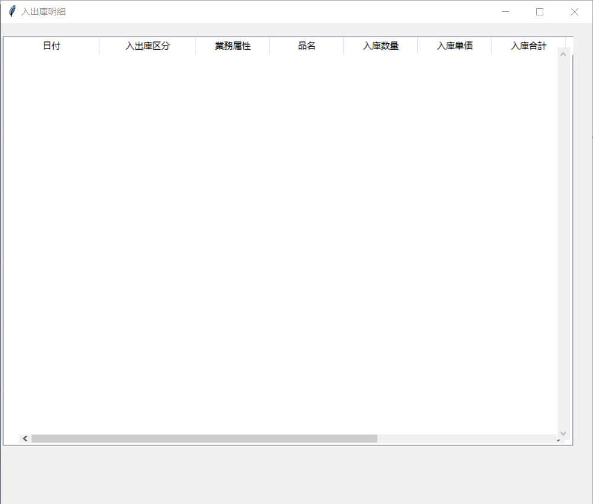
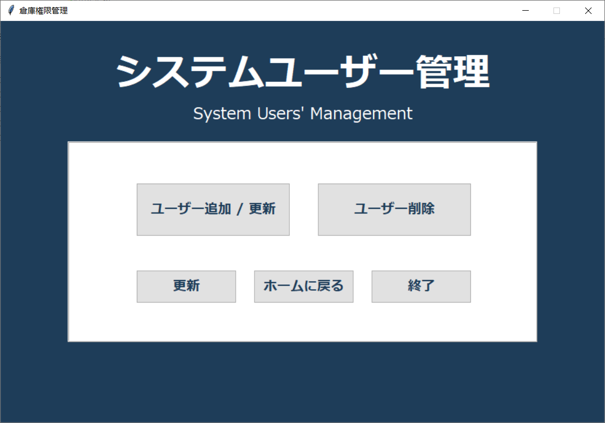
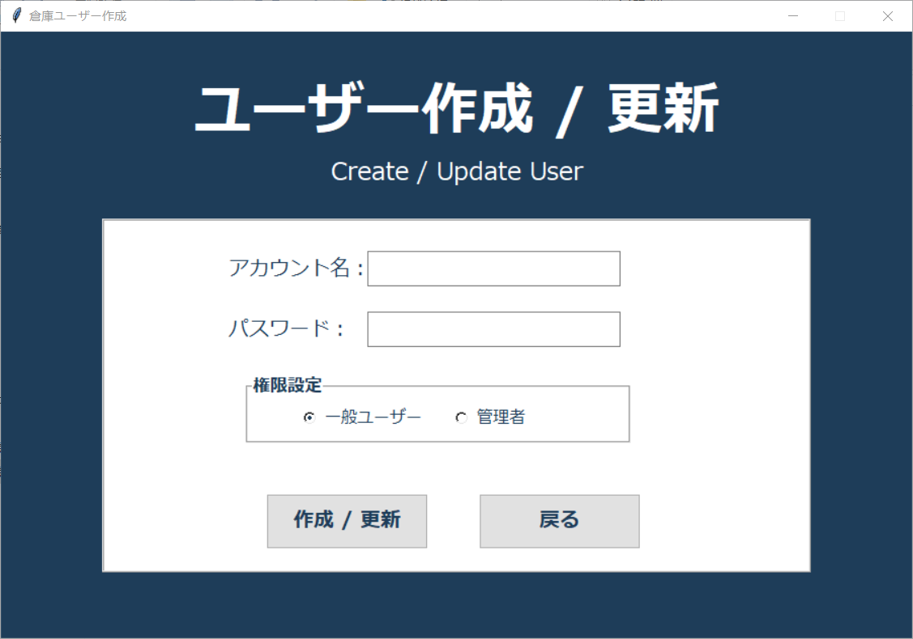
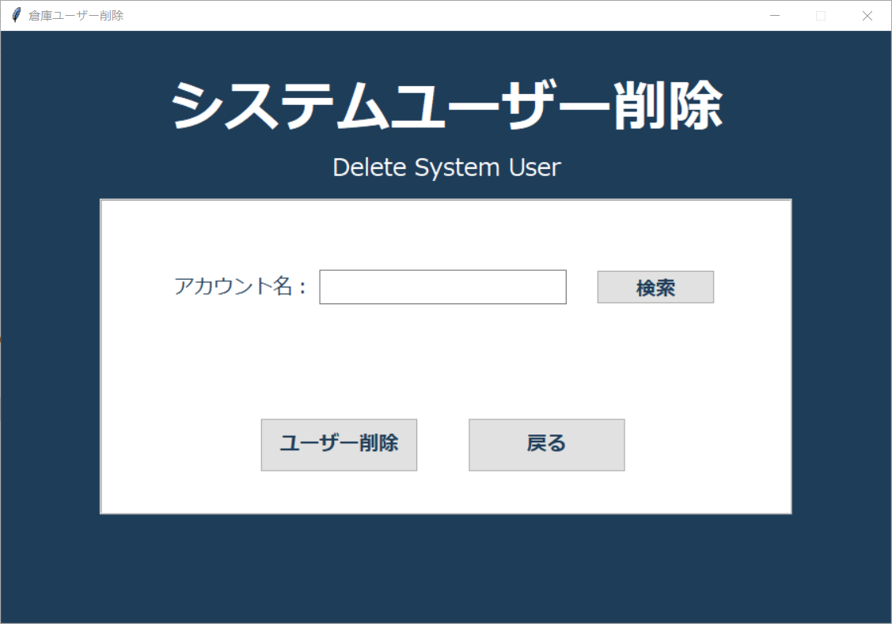
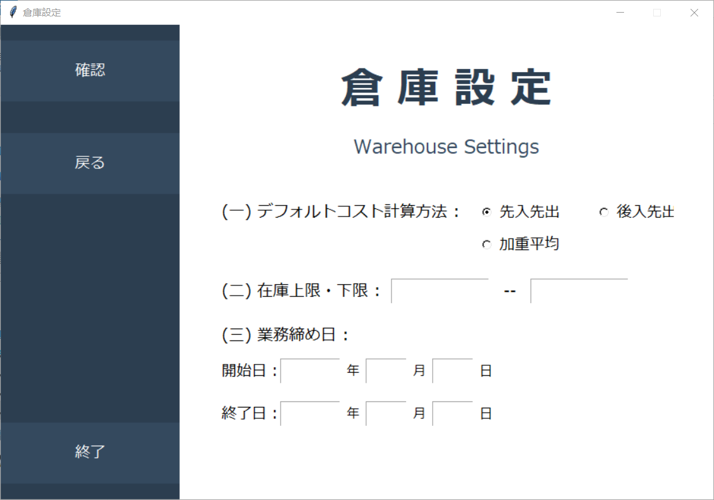

This warehouse management system is designed to handle complete inventory lifecycle management, including purchasing, sales, transfers, and returns. It integrates accounting functionality with inventory tracking, supports multiple cost calculation methods (FIFO, LIFO, Weighted Average), and provides period summaries and statistical analyses. Users should ensure data consistency and proper setup of accounting periods, as many calculations depend on correct historical records. <br>
<br>
この倉庫管理システムは、仕入れ、販売、移動、返品を含む在庫ライフサイクル管理全般を扱うように設計されています。会計機能と在庫管理を統合し、複数の原価計算方法（FIFO、LIFO、加重平均法）をサポートし、期間集計や統計分析を提供します。多くの計算は過去の記録に依存するため、会計期間の設定やデータの整合性を確実に維持する必要があります。
``` text
|- InAndOut.py
|  - Handles import and export of goods and materials. Includes data validation, database insertion, and retrieval for inventory transactions.
|  - 商品・原材料の入出庫を管理します。データの検証、データベースへの登録、在庫取引の取得を含みます。
|
|- create.py
|  - Provides functions to create new inventory items, accounts, or related database records.
|  - 新しい在庫品目、会計科目、関連データベースレコードを作成する機能を提供します。
|
|- createAndDelete.py
|  - Combines creation and deletion functionalities for inventory items, accounts, and auxiliary records in the system.
|  - システム内の在庫品目、会計科目、補助レコードの作成と削除の機能を統合します。
|
|- delete.py
|  - Handles deletion of inventory items, accounts, or related database records, with confirmation dialogs.
|  - 在庫品目、会計科目、関連データベースレコードの削除を処理し、確認ダイアログを表示します。
|
|- home.py
|  - Main home screen after login. Provides navigation to all functionalities of the warehouse management system.
|  - ログイン後のホーム画面。倉庫管理システムの全機能へのナビゲーションを提供します。
|
|- log.py
|  - Manages user login and logging events. Validates credentials and records login history.
|  - ユーザーのログインとログ記録を管理します。認証情報を検証し、ログイン履歴を記録します。
|
|- main.py
|  - Main entry point for the warehouse management system. Initializes database connection and launches the home interface.
|  - 倉庫管理システムのメインエントリーポイント。データベース接続を初期化し、ホーム画面を起動します。
|
|- periodsummary.py
|  - Generates period summaries including total income, total costs, and net profit for a selected accounting period.
|  - 選択した会計期間の総収入、総費用、純利益などの期間集計を生成します。
|
|- purchase.py
|  - Handles purchase transactions of goods and raw materials, updates inventory and accounting records.
|  - 商品および原材料の購入取引を処理し、在庫および会計記録を更新します。
|
|- sellitems.py
|  - Handles sales transactions, including revenue calculation, inventory reduction, and cost allocation.
|  - 販売取引を処理します。収益計算、在庫減少、原価配分を含みます。
|
|- setting.py
|  - Manages system configuration and settings, such as accounting period, cost method, and user preferences.
|  - 会計期間、原価計算方法、ユーザー設定など、システムの設定を管理します。
|
|- statistics.py
|  - Provides statistical analysis of inventory, sales, and costs over a given period. Can generate charts or summaries.
|  - 指定期間の在庫、売上、費用の統計分析を提供します。チャートや集計レポートの生成も可能です。
|
|- subledger.py
|  - Manages subsidiary ledger details, including inventory movements, raw materials, and related accounting entries.
|  - 補助元帳の詳細を管理します。在庫の動き、原材料、関連する会計仕訳を含みます。
|
|- transaction.py
|  - Processes all transactions during an accounting period. Calculates cost of goods sold using FIFO/LIFO/Weighted Average and computes period profit.
|  - 会計期間中のすべての取引を処理します。FIFO/LIFO/加重平均法で売上原価を計算し、期間利益を算出します。
```
### login

### home

### statistic

### summary

### detail

### userManagement

### addUser

### deleteUser

### setting

